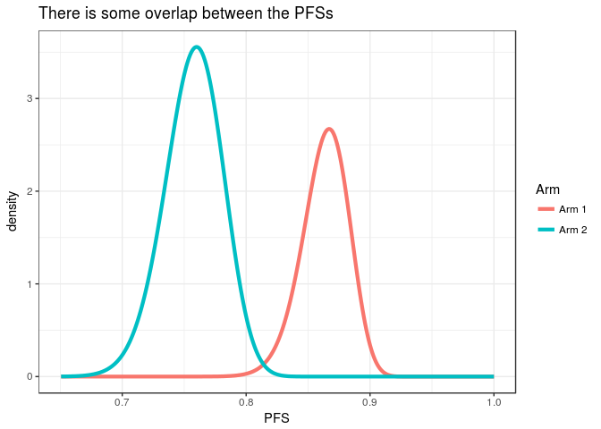
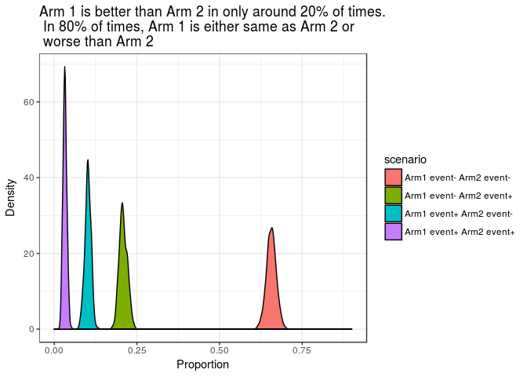

# Interpretation of effectiveness between two interventions: A new perspective


```
## ── Attaching packages ───────────────────────── tidyverse 1.2.1 ──
```

```
## ✔ ggplot2 2.2.1     ✔ purrr   0.2.4
## ✔ tibble  1.4.1     ✔ dplyr   0.7.4
## ✔ tidyr   0.7.2     ✔ stringr 1.2.0
## ✔ readr   1.1.1     ✔ forcats 0.2.0
```

```
## ── Conflicts ──────────────────────────── tidyverse_conflicts() ──
## ✖ dplyr::filter() masks stats::filter()
## ✖ dplyr::lag()    masks stats::lag()
```

## Study

The study in question is the [ALCYONE Trial](http://www.nejm.org/doi/full/10.1056/NEJMoa1714678), 
published in NEJM in 12 December 2017 by María-Victoria Mateos, 
Meletios A Dimopoulos, et al.

The investigators studied the effect of adding Daratumumab with 
Bortezomib, Melphalan and Prednisolone in patients with 
freshly detected Myeloma ineligible for Autologous Bone Marrow Transplantation.

The study arms were **Arm 1:** Daratumumab + Bortezomib + 
Melphalan + Prednisolone and **Arm 2:** Bortezomib + Melphalan + Prednisolone

The primary outcome was Progression free survival 
(time to progression or death, whichever was early).

The outcome was measured at 12 months and 18 months post 
initiation of treatment.

## Outcome in nutshell verbatim from the article

### At 12 and 18 months

> The Kaplan–Meier estimate of the 12-month rate of 
progression-free survival (PFS) was 86.7% (95% CI, 82.6 to 89.9) 
in the daratumumab group and 76.0% (95% CI, 71.0 to 80.2) in 
the control group; the 18-month rate of progression-free survival
was 71.6% (95% CI, 65.5 to 76.8) in the daratumumab group and
50.2% (95% CI, 43.2 to 56.7) in the control group.

## Meaning of PFS of 86.7% (95% CI, 82.6 to 89.9)

We want to find out the population PFS (which is unknown to us and is a probability) 
of patients with a particular intervention and we can only estimate it from 
taking a random sample from the underlying population. The RCT 
is a way to obtain a random sample from a given underlying 
population. The point estimate of the PFS in the above example 
is 86.7%, which is the PFS of a particular random sample 
which is recruited in the study. The 95% confidence interval 
is the range which contain the population PFS 95% of the times 
if repeated random samples are selected. So, the population 
PFS in this case is somewhere between 82.6 and 89.9%, and we will 
be incorrect around 5% of times.

Crudely speaking, PFS is the proportion of patients who have not died or 
have disease progression at the end of a said period of time.

## Inference of the study

**For illustration sake, We will only concentrate on the 12 month figures.**

So, at the end of study, we get an estimate of the population probability 
of PFS in form of a range of probabilities, which is depicted 
in form of confidence intervals.

The probability density of the 12 months PFS for Arm 1 and Arm 2 
are 86.7% (95% CI, 82.6 to 89.9) and 76.0% (95% CI, 71.0 to 80.2)
respectively. The shape is depicted as below.



There is clearcut evidence that except for a small area, Arm 1 results 
in better PFS than Arm 2. Small overlapping area is not evident in the 
confidence intervals.

It is evident that there is significant uncertainity in the population PFSs and 
it is also possible that Arm 2 may be having better PFS than Arm 1, although 
the probability for the same is very small.

## What are we interested in?

As clinicians, we are interested in knowing the **proportion 
of times Arm 1 does better than Arm 2, when we treat one 
patient with Arm 1 and another patient with Arm 2.**

## Simulation study

We will design a simulation study in which we will carry out the 
following steps.

1.  We will assign a population PFS estimated from the 
distribution of the sample PFS for both the treatment arms.

1.  For each treatment arm, given the population PFS probability as 
obtained from step 1, we will calculate whether event has occurred 
for each of the arms and note the status down.

1.  We will repeat steps 1 and 2 1000 times and get the 
proportion of times patients with Arm 1 do not achieve the 
event and Arm 2 achieve them.

1.   We will repeat the above steps to get an idea about 
the confidence width of the proportion.


### Results from the simulation study


scenario                     mean       sd   minimum   maximum
------------------------  -------  -------  --------  --------
Arm1 event- Arm2 event-    0.6567   0.0147     0.614     0.700
Arm1 event- Arm2 event+    0.2090   0.0122     0.176     0.244
Arm1 event+ Arm2 event-    0.1020   0.0093     0.074     0.133
Arm1 event+ Arm2 event+    0.0323   0.0058     0.017     0.052

### Graphical representation of the results



### Interpretation of the results

So, we can seen that pairwise Arm 1 is better Arm 2 in only 
around 20% of times and in rest of the times, Arm 1 and Arm 2 
are equivalent or Arm 1 is worse than Arm 2.

At 12 months, the performance of Daratumumab is not that spectacular 
as it looks.

